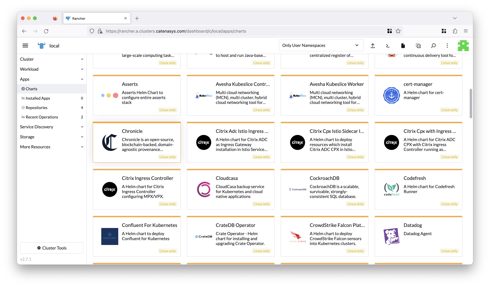
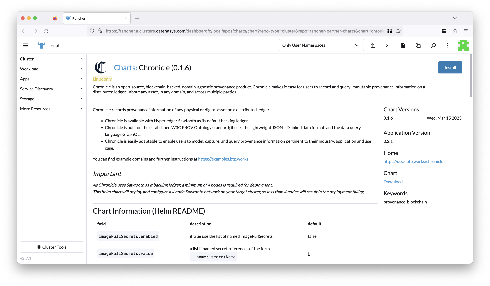
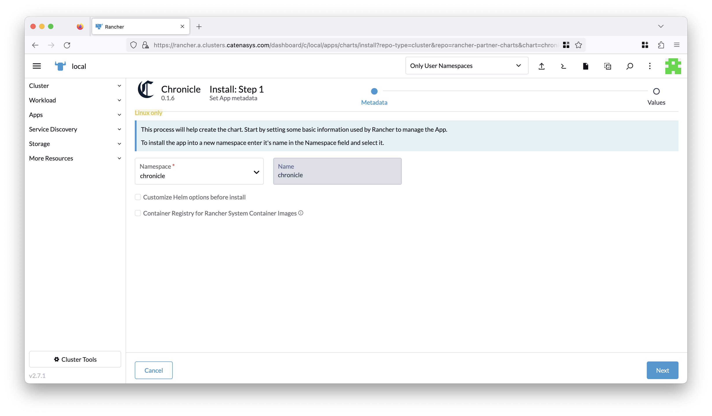
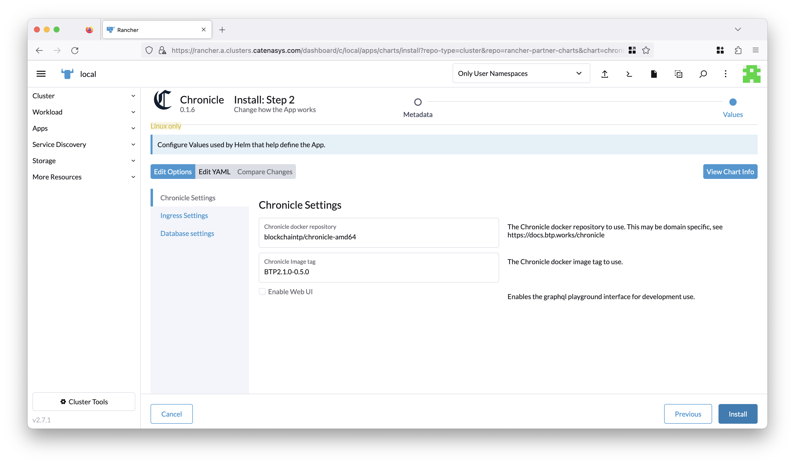
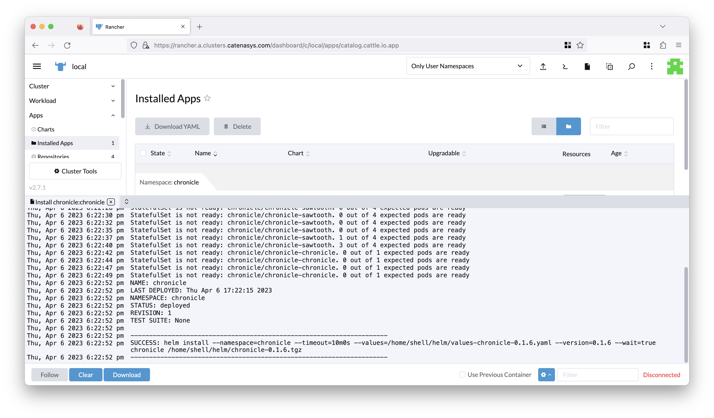
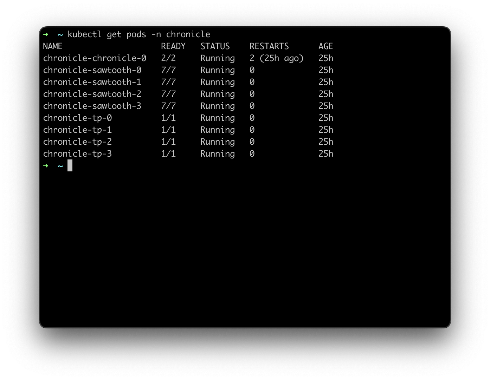
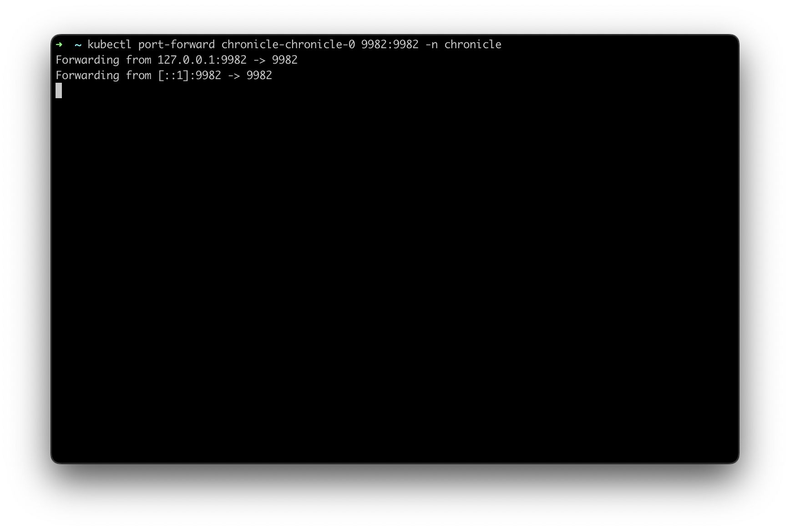
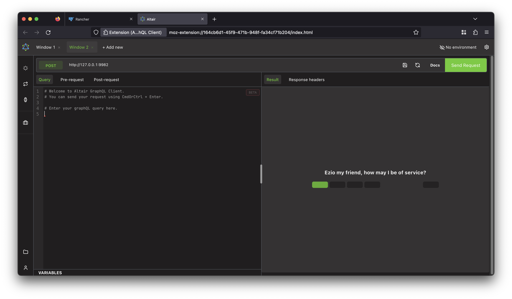
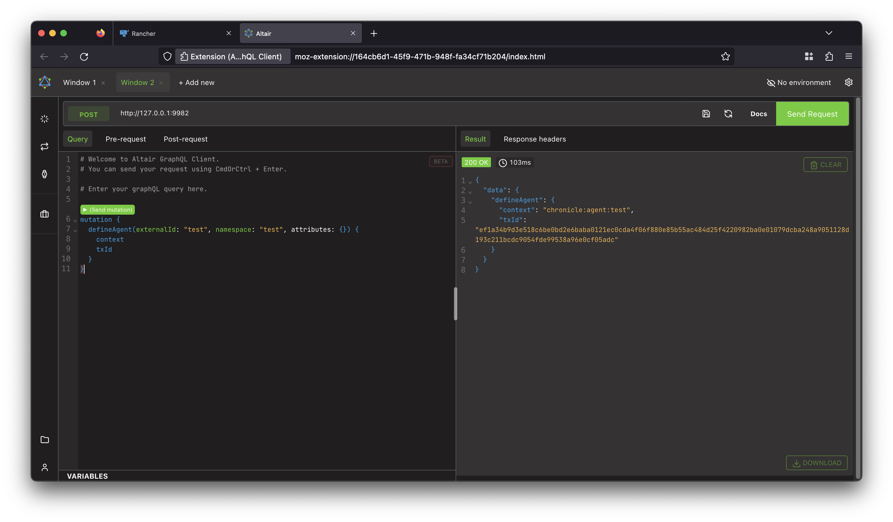

# Chronicle SUSE Rancher Cookbook

Recipe for installing Chronicle from the SUSE Rancher marketplace

## Useful Links

* [Chronicle Overview](https://btp.works/chronicle)
* [Chronicle Docs](https://docs.btp.works/chronicle)
* [Chronicle Examples](https://examples.btp.works)

## Prerequisites

You will need the following:

!!!Important
    As Chronicle uses Sawtooth as it backing ledger, a minimum of 4 nodes is
    required for deployment.

* 4 node Kubernetes cluster managed by
  [SUSE Rancher](https://www.suse.com/products/suse-rancher/) v2.6 or later.

* [kubectl](https://kubernetes.io/docs/tasks/tools/#kubectl) configured to
  access your cluster

## Install Chronicle

Log in to Rancher and select the cluster you want to install Chronicle on.
In our example, this will be the `local` cluster

From the left menu, select _Apps_ and then _Charts_.
Choose the Chronicle chart from the list of partner charts:



This will take you to the following screen,
click on the _Install_ button on the top right of the page:



Here, you will need to specify the _namespace_ for your Chronicle
installation. In our example, we will use the existing `chronicle` namespace.

Now, click the _Next_ button on the bottom right of the page:



On this screen you can configure your Chronicle installation. On the left hand
side, you will find three options:

* **Chronicle Settings** - Here you can configure the Chronicle image and tag
  that you want to use. We will leave these as the defaults for now, using
  the [untyped version of Chronicle](https://docs.btp.works/chronicle/untyped_chronicle/).
  You can also enable a development GraphQL playground, however in this example
  we will leave this disabled, and use the Altair GraphQL client instead.

* **Ingress Settings** - If you'd like to enable an ingress for Chronicle,
  you can specify this here. This is optional.

* **Database Settings** - If you'd like to use an external Postgres database,
  you can specify this here. This is also optional.

Click the _Install_ button on the bottom right of the page:



Rancher will now install Chronicle on your chosen cluster, in our
example the `local` cluster. It may take a few minutes for the Chronicle
images to be pulled down, and for the underlying
Sawtooth network to be deployed.



We will now switch to a local terminal window to test our Chronicle install.

Once you've opened a local terminal, start by confirming that you can connect to
your Kubernetes cluster using `kubectl` by running this command:

```bash
kubectl get pods -n chronicle
```



We now need to set up a port forward so that we can access the Chronicle api
on our local machine.
Run the following command to set up a port forward:

```bash
kubectl port-forward chronicle-chronicle-0 9982:9982 -n chronicle
```

This will set up a port forward to your Sextant install, and make it accessible
on your local machine:



You can now access the Chronicle GraphQL API using the following URL at [http://127.0.0.1:9982](http://127.0.0.1:9982)

We will use the [Altair GraphQL client](https://github.com/altair-graphql/altair)
to test our Chronicle install in the browser

Open the Altair GraphQL client in your browser, and paste in the following URL `http://127.0.0.1:9982`



Copy and paste the following query into the Altair GraphQL client:

```graphql
mutation {
  defineAgent(externalId: "test", namespace: "test", attributes: {}) {
    context
    txId
  }
}
```

Click the _Send Request_ button to run the query, and you should see a
response on the right hand side:



Congratulations, you have successfully installed Chronicle on your Kubernetes
cluster using Rancher!

By default the Chronicle docker image deployed is
the [untyped version of Chronicle](https://docs.btp.works/chronicle/untyped_chronicle/).
This should only be used for testing deployments.

You should now build a docker image using your own domain, or one of
the [Chronicle examples](https://examples.btp.works).

Once you've built this image, you can edit your running Chronicle deployment
using SUSE Rancher and update the repository/tag details. Once you confirm these
changes Rancher will automatically update the deployment.
The same process can be employed whenever you rebuild your image.

The [Chronicle Bootstrap](https://github.com/btpworks/chronicle-bootstrap) repo
provides instructions and example scripts for building your own docker image.

For more details on modeling your domain, see the [Chronicle Docs](https://docs.btp.works/chronicle).
