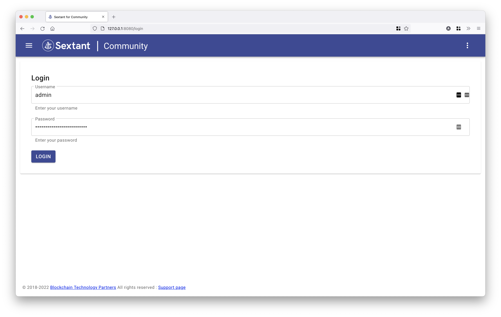

# SUSE Rancher Cookbook

Recipe for installing
Sextant Community Edition on a Rancher managed kubernetes cluster to deploy
and manage blockchain networks.

## Prerequisites

* [SUSE Rancher](https://www.suse.com/products/suse-rancher/) v2.6 or later with a Kubernetes cluster v1.19 or later
* [kubectl](https://kubernetes.io/docs/tasks/tools/#kubectl) configured to access your cluster

## Sign up for an evaluation licence

To install Sextant Community edition, you will need credentials
supplied by BTP.

Please complete this form to request credentials: [https://www.blockchaintp.com/sextant/suse-rancher](https://www.blockchaintp.com/sextant/suse-rancher)

!!!Important
    Use of the Sextant Community Edition is governed by our
    [Marketplace EULA](https://sextant-resources.s3.amazonaws.com/agreements/Blockchain+Technology+Partners+Limited+(Marketplace)+End+User+License+Agreement.pdf)
    with the exception of Daml support which is subject to our
    [Evaluation EULA](https://sextant-resources.s3.amazonaws.com/agreements/Blockchain+Technology+Partners+Limited+(Evaluation)+End+User+License+Agreement.pdf).

### Useful links

* [Sextant Overview](https://www.blockchaintp.com/sextant)
* [Sextant Docs](https://docs.blockchaintp.com/en/latest/sextant/overview/)

## Install Sextant

Log in to Rancher and select the cluster you want to install Sextant on,
in our example, this will be the local cluster.


From the left menu, select _Apps & Marketplace_ and then _Charts_.
Choose the Sextant chart from the list of partner charts


Select or create a namespace for your Sextant install, we will use a
namespace called `sextant` in this example.

Choose a name for your install, we will leave the default name of sextant

Click the Next button on the bottom right of the page.


!!!Important
    Make sure you have your BTP supplied credentials ready. These can be
    requested at [https://www.blockchaintp.com/sextant/suse-rancher](https://www.blockchaintp.com/sextant/suse-rancher)

On this screen you can configure your Sextant install, the only required fields
are your `Username` and `Password` credentials provided by BTP.

If you'd like to enable an ingress for Sextant, or use an external
Postgres database, you can edit these settings as needed.

For our example install, we will leave everything as default.

Enter your user credentials in the form, and then click the _Install_ button
on the bottom right of the page.


Rancher will now install Sextant on your local cluster, it may take a few
minutes for the Sextant images to be pulled down to your cluster from our private repo.


Once the installation has completed, you will see the NOTES from the install.
In our example they are:

```
NOTES:
1. Get the initial Sextant application username and password by running this command
kubectl describe pod/sextant-0 --namespace sextant | grep INITIAL_
2. Get the application URL by running these commands:
export POD_NAME=$(kubectl get pods -l "app.kubernetes.io/name=sextant" -o jsonpath="{.items[0].metadata.name}")
echo "Visit http://127.0.0.1:8080 to use your application"
kubectl port-forward $POD_NAME 8080:80

```

Make a note of the instructions, and we will now switch to a local terminal
window to finish setting up Sextant.

First, confirm that you can connect to your kubernetes cluster using
`kubectl` by running `kubectl get pods`


Then run the first command from the install notes. In our example this is:

```
kubectl describe pod/sextant-0 --namespace sextant | grep INITIAL_

```

This will fetch the initial random password for your Sextant install.

!!!Important
    Make sure you save this password, as it will not be possible to retrieve
    it if the Sextant deployment is restarted.


Now run the second command from the install notes. In our example this is:

```
export POD_NAME=$(kubectl get pods -l "app.kubernetes.io/name=sextant" -o jsonpath="{.items[0].metadata.name}")
echo "Visit http://127.0.0.1:8080 to use your application"
kubectl port-forward $POD_NAME 8080:80

```

This will set up a port forward to your Sextant install, and make it accessible
on your local machine at [http://127.0.0.1:8080](http://127.0.0.1:8080)


Switch back to your browser and open the URL show in the terminal output. In
our case [http://127.0.0.1:8080](http://127.0.0.1:8080)

This will load the Sextant UI and you can log in using the initial password
retrieved earlier



At this point you are all set to start using Sextant to deploy and manage
blockchain networks.

The first thing you will need to do is add a cluster to Sextant. Detailed
instructions on how to do this can be found
[here](https://docs.blockchaintp.com/en/latest/sextant/clusters/management/).

!!!Note
    Assuming that your local cluster has at least four nodes you can add this to
    Sextant.

!!!Important
    To access all Sextant's features you can also apply for a Sextant
    Enterprise Edition evaluation
    [here](https://www.blockchaintp.com/sextant/evaluation).
