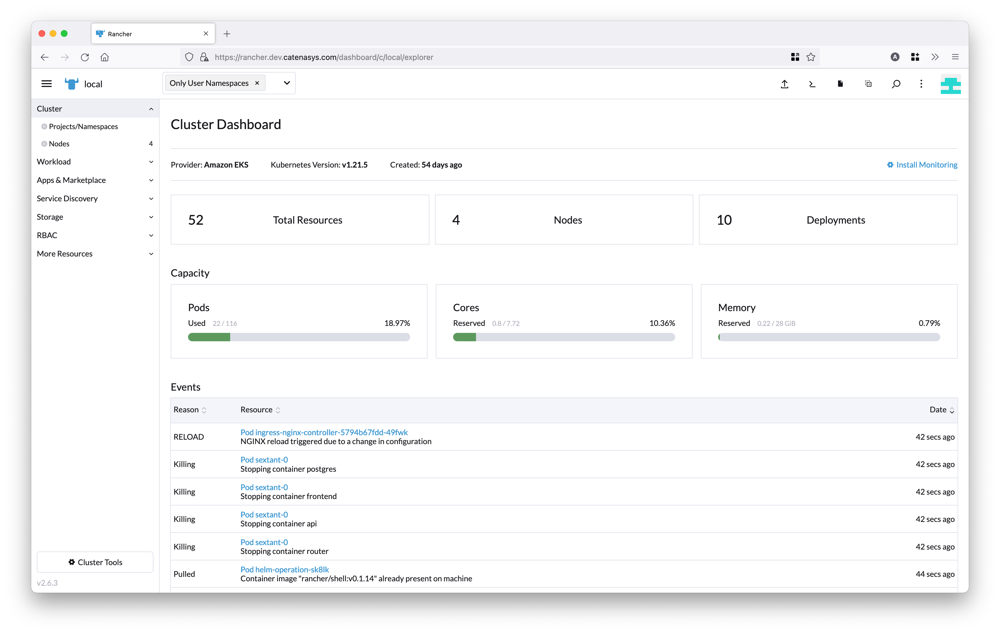
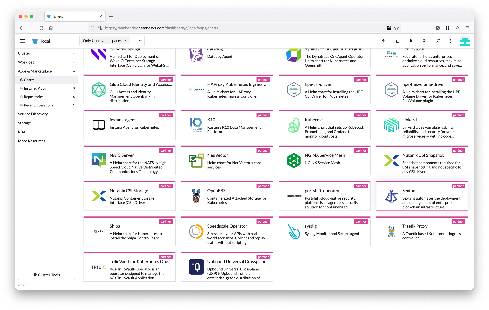
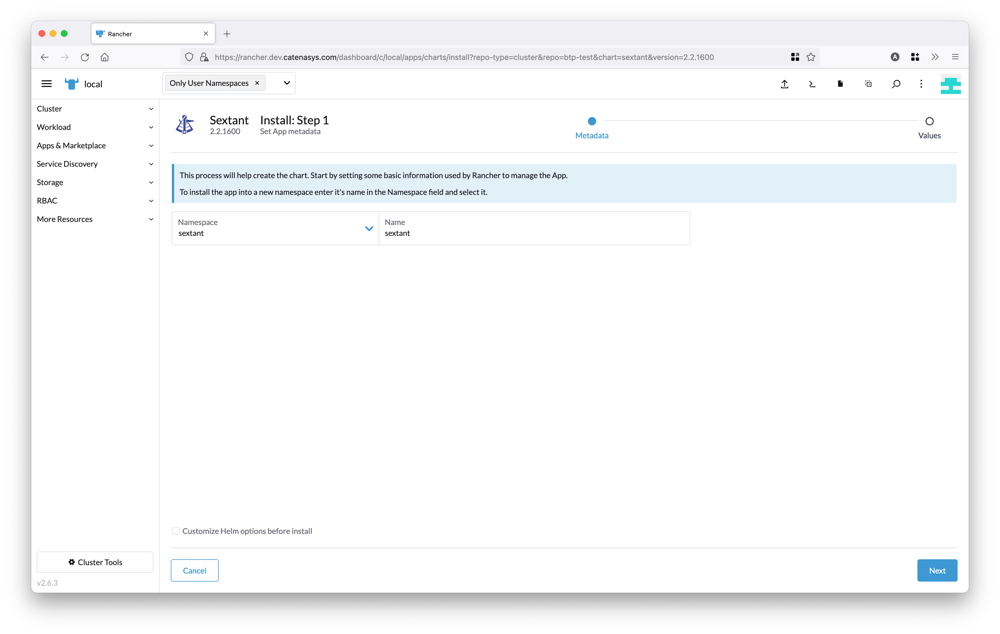
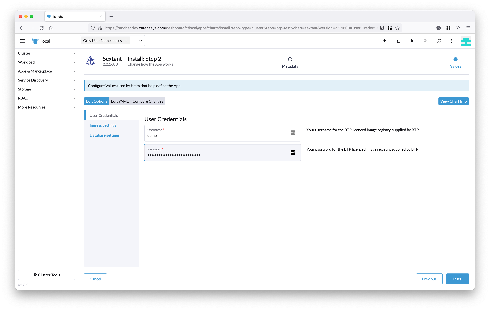
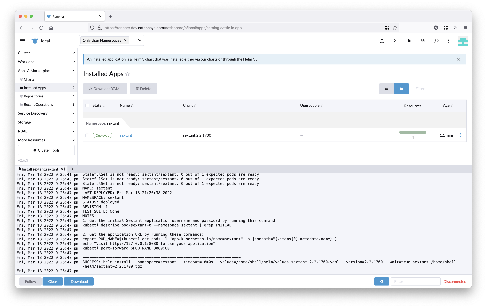
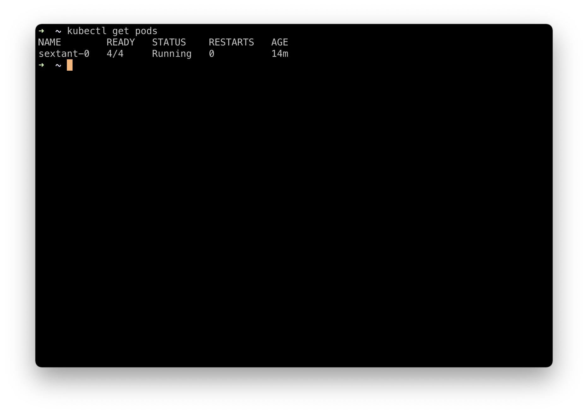
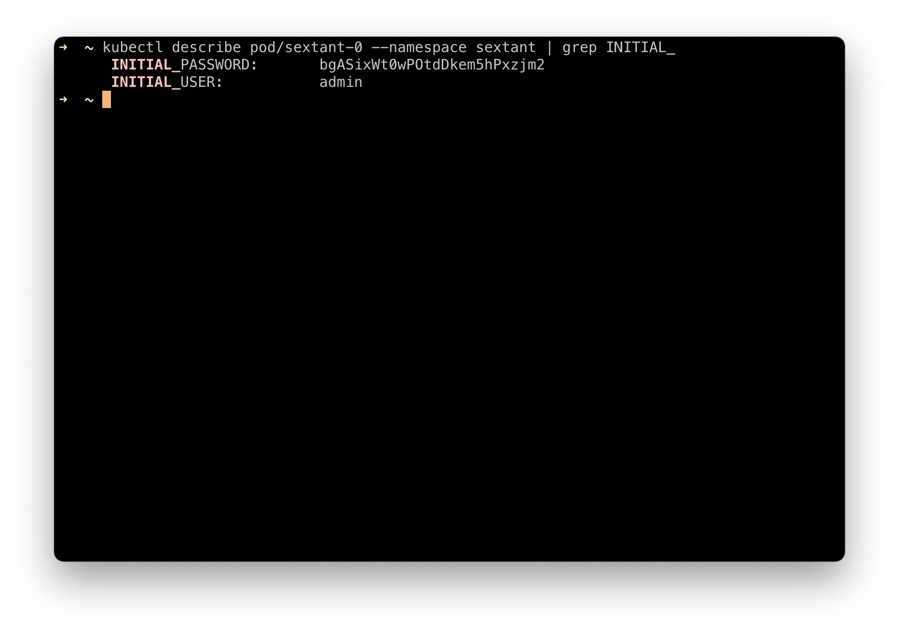
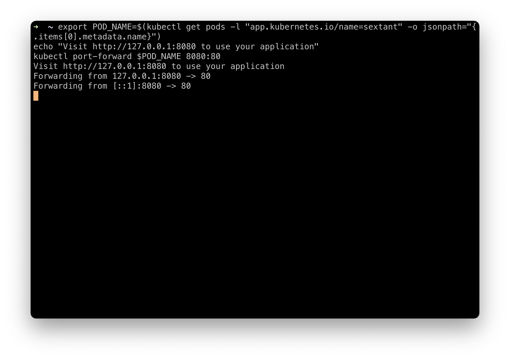

# SUSE Rancher Cookbook

Recipe for installing Sextant on a SUSE Rancher managed
Kubernetes cluster.

## License

Use of the Sextant Community Edition is governed by our
[Marketplace EULA](https://sextant-resources.s3.amazonaws.com/agreements/Blockchain+Technology+Partners+Limited+(Marketplace)+End+User+License+Agreement.pdf)
with the exception of Chronicle and Daml support which is subject to our
[Evaluation EULA](https://sextant-resources.s3.amazonaws.com/agreements/Blockchain+Technology+Partners+Limited+(Evaluation)+End+User+License+Agreement.pdf).

## Useful Links

* [Sextant Overview](https://btp.works/sextant)
* [Sextant Docs](https://docs.btp.works/sextant/overview/)

## Prerequisites

To install the Sextant Community edition, you will need to obtain user
credentials from BTP. If you don't have these already, you can request them
[here](https://btp.works/sextant/suse-rancher).

You will also need the following:

* [SUSE Rancher](https://www.suse.com/products/suse-rancher/) v2.6 or later with
  a Kubernetes cluster v1.19 or later
* [kubectl](https://kubernetes.io/docs/tasks/tools/#kubectl) configured to
  access your cluster

## Install Sextant

Log in to Rancher and select the cluster you want to install Sextant on.
In our example, this will be the local Rancher cluster:



From the left menu, select _Apps & Marketplace_ and then _Charts_.
Choose the Sextant chart from the list of partner charts:



This will take you to the following screen:



Here, you will need to specify the _namespace_ and _name_ for your Sextant
installation. In our example, we will use `sextant` in both cases.

!!!Note
    If the namespace doesn't exist, the installation process will automatically
    create this for you.

!!!Important
    Make sure you have your BTP supplied credentials ready before continuing to
    the next step. As noted above, you can request these
    [here](https://btp.works/sextant/suse-rancher).

Now, click the _Next_ button on the bottom right of the page:



On this screen you can configure your Sextant installation. On the left hand
side, you will find three options:

* **User Credentials** - The only required fields are the `Username` and
  `Password` credentials that you obtained from BTP. These are entered here.
* **Ingress Settings** - If you'd like to enable an ingress for Sextant, you can
  specify this here. This is optional.
* **Database Settings** - If you'd like to use an external Postgres database,
  you can specify this here. This is also optional.

Enter your user credentials in the form, and then click the _Install_ button
on the bottom right of the page.

Rancher will now install Sextant on your local cluster. It may take a few
minutes for the Sextant images to be pulled down to your cluster from our
private repo:



Once the installation has completed, you will see the NOTES from the
installation. In our example, these are:

```text
NOTES:
1. Get the initial Sextant application username and password by running this
command kubectl describe pod/sextant-0 --namespace sextant | grep INITIAL_
2. Get the application URL by running these commands:
export POD_NAME=$(kubectl get pods -l "app.kubernetes.io/name=sextant" -o jsonpath="{.items[0].metadata.name}")
echo "Visit http://127.0.0.1:8080 to use your application"
kubectl port-forward $POD_NAME 8080:80
```

Make a note of these instructions, as we will now switch to a local terminal
window to finish setting up Sextant.

Once you've opened a local terminal, start by confirming that you can connect to
your Kubernetes cluster using `kubectl` by running this command:

```bash
kubectl get pods
```



Then, run the first command from the installation NOTES.
In our example, this is:

```bash
kubectl describe pod/sextant-0 --namespace sextant | grep INITIAL_
```

This will display the initial username/password combination for your Sextant
installation.

!!!Important
    Make sure you save this combination, as it will not be possible to retrieve
    it if the Sextant deployment is restarted.



Now, run the second command from the installation NOTES.
In our example, this is:

```bash
export POD_NAME=$(kubectl get pods -l "app.kubernetes.io/name=sextant" -o jsonpath="{.items[0].metadata.name}")
echo "Visit http://127.0.0.1:8080 to use your application"
kubectl port-forward $POD_NAME 8080:80
```

This will set up a port forward to your Sextant install, and make it accessible
on your local machine:



Switch back to your browser and open the URL shown in the terminal output. In
our example, this is [http://127.0.0.1:8080](http://127.0.0.1:8080). This will
load the Sextant UI where you can log in using the initial username/password
retrieved earlier:


At this point, you are all set to start using Sextant to deploy and manage
blockchain networks. The first thing you will need to do is add a cluster to
Sextant. Detailed instructions on how to do this can be found
[here](https://docs.btp.works/sextant/clusters/management/).

!!!Note
    Assuming that your local cluster has at least four nodes, you can add this
    to Sextant and use it to deploy a four node distributed ledger network.

!!!Important
    To access all Sextant's features, you can also apply for a Sextant
    Enterprise Edition evaluation
    [here](https://btp.works/sextant/evaluation).
