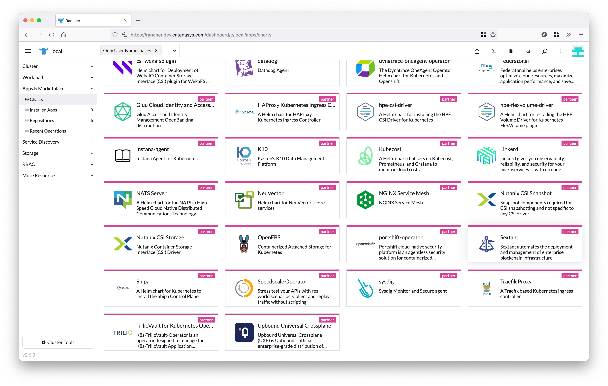
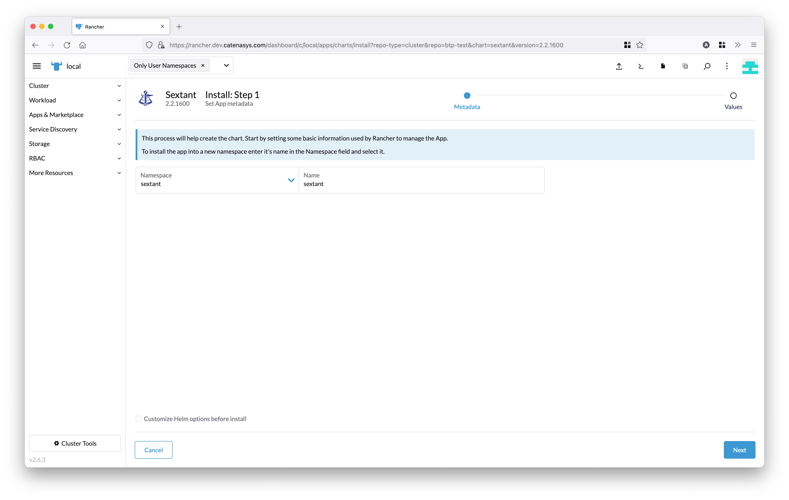
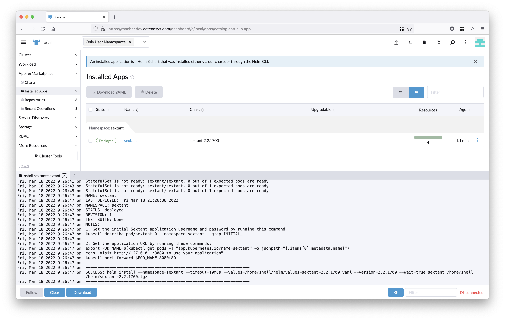
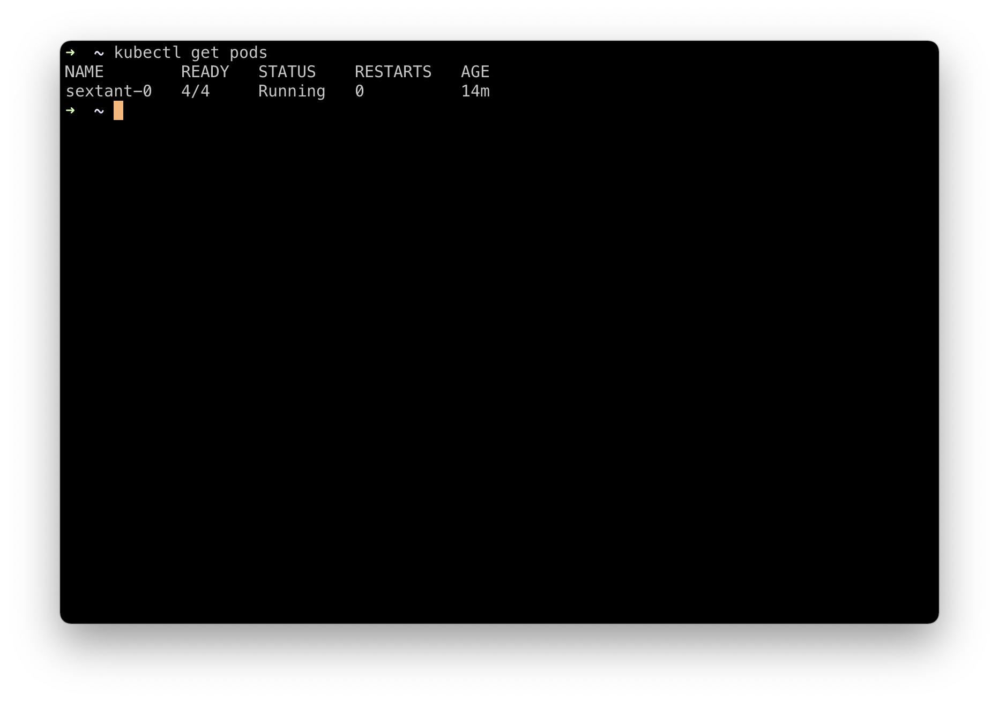
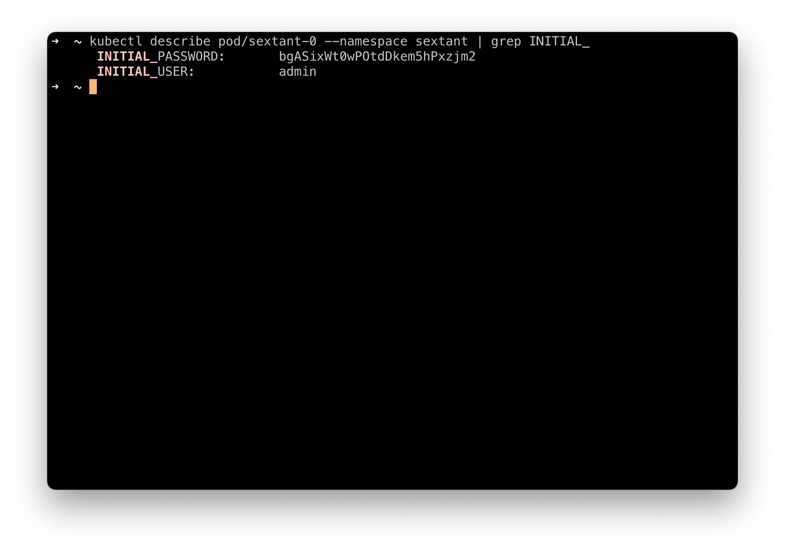
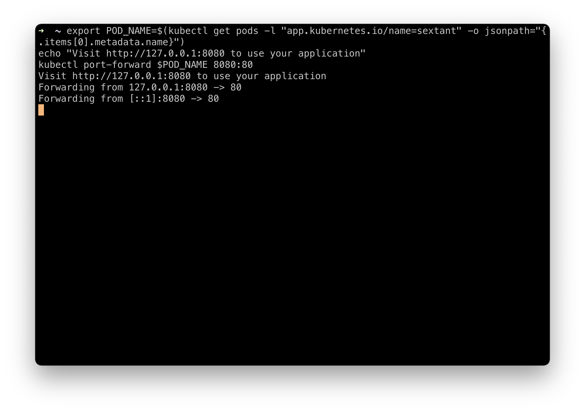
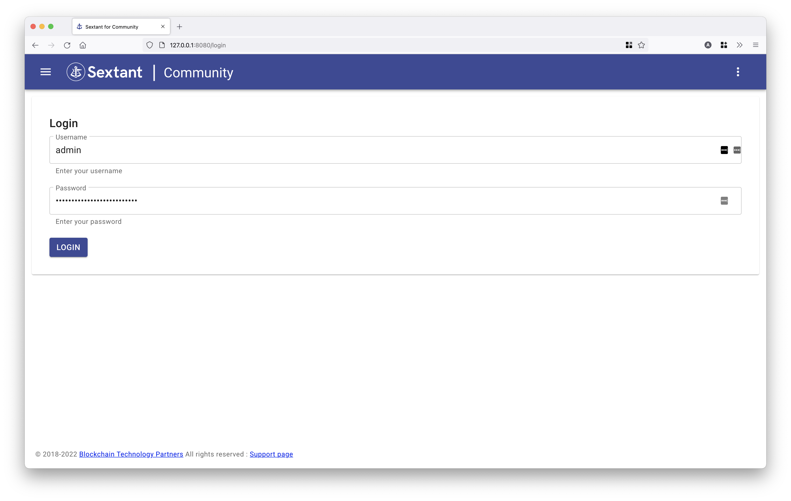

# Rancher Cookbook

Recipe for installing
_Sextant | Community_ edition on a Rancher managed kubernetes cluster to deploy
and manage blockchain networks.

## Install Prerequisite Tools

You will need the up-to-date versions of the following tools installed -

* [kubectl](https://kubernetes.io/docs/tasks/tools/#kubectl)

## Sign up for an evaluation licence

To install _Sextant | Community_ edition, you will need credentials
supplied by BTP.

Please complete this form to request credentials: [https://www.blockchaintp.com/sextant/suse-rancher](https://www.blockchaintp.com/sextant/suse-rancher)

Note:
Use of the Sextant Community Edition is governed by our [Marketplace EULA](https://sextant-resources.s3.amazonaws.com/agreements/Blockchain+Technology+Partners+Limited+(Marketplace)+End+User+License+Agreement.pdf)
with the exception of Daml support which is subject to our [Evaluation EULA](https://sextant-resources.s3.amazonaws.com/agreements/Blockchain+Technology+Partners+Limited+(Evaluation)+End+User+License+Agreement.pdf)

Find out more at [blockchaintp.com/sextant](https://www.blockchaintp.com/sextant)

For documentation, visit [docs.blockchaintp.com](https://docs.blockchaintp.com)

## Create a cluster and set up Rancher

We will use an AWS EKS cluster, which will both run Rancher server and act as
the cluster for our Sextant install.

Follow the standard Rancher instructions to set up an EKS
cluster for Rancher: [Installing Rancher on Amazon EKS](https://rancher.com/docs/rancher/v2.6/en/installation/install-rancher-on-k8s/amazon-eks/)

Once you have the cluster set up, install
Rancher: [Installing the Rancher Helm chart](https://rancher.com/docs/rancher/v2.6/en/installation/install-rancher-on-k8s/#install-the-rancher-helm-chart)

You will also need access to the cluster from your local machine via kubectl.
If needed, you can get credentials for the cluster using eksctl:

1 - Get the name of your cluster:

```bash
eksctl get clusters
```

2 - Get kubeconfig credentials

```bash
eksctl utils write-kubeconfig --cluster=rancher-server [--kubeconfig=<path>]
```

You should now have Rancher installed on your eksctl cluster and
accessible via URL

## Install Sextant

Log in to Rancher and select the cluster you want to install Sextant on,
in our example, this will be the local cluster.


From the left menu, select Apps & Marketplace and then Charts.
Choose the Sextant chart from the list of partner charts



Select or create a namespace for your Sextant install, we will use a
namespace called `sextant` in this example.

Choose a name for your install, we will leave the default name of sextant



Click the Next button on the bottom right of the page.

!!!Important
    Make sure you have your BTP supplied credentials ready. These can be
    requested at [https://www.blockchaintp.com/sextant/suse-rancher](https://www.blockchaintp.com/sextant/suse-rancher)

On this screen you can configure your Sextant install, the only required fields
are your `Username` and `Password` as supplied by BTP.

TODO:
Add Ingress and Postgres DB docs links

If you'd like to enable an ingress for Sextant, or use an external
Postgres database, you can edit these settings as needed.

For our example install, we will leave everything as default.

Enter your user credentials in the form, and then click the Install button
on the bottom right of the page.


Rancher will now install Sextant on your local cluster, it may take a few
minutes for the Sextant images to be pulled down to your cluster.



Once the installation has completed, you will see the NOTES from the install.
In our example they are:

```
NOTES:
1. Get the initial Sextant application username and password by running this command
kubectl describe pod/sextant-0 --namespace sextant | grep INITIAL_
2. Get the application URL by running these commands:
export POD_NAME=$(kubectl get pods -l "app.kubernetes.io/name=sextant" -o jsonpath="{.items[0].metadata.name}")
echo "Visit http://127.0.0.1:8080 to use your application"
kubectl port-forward $POD_NAME 8080:80

```

Make a note of the instructions, and we will now switch to a local terminal
window to finish setting up Sextant.

First, confirm that you can connect to your kubernetes cluster using
`kubectl` by running `kubectl get pods`



Then run the first command from the install notes. In our example this is:

```
kubectl describe pod/sextant-0 --namespace sextant | grep INITIAL_

```

This will fetch the initial random password for your Sextant install.

!!!Important
    Make sure you save this password, as it will not be possible to retrieve
    it if the Sextant deployment is restarted.



Now run the second command from the install nodes. In our example this is:

```
export POD_NAME=$(kubectl get pods -l "app.kubernetes.io/name=sextant" -o jsonpath="{.items[0].metadata.name}")
echo "Visit http://127.0.0.1:8080 to use your application"
kubectl port-forward $POD_NAME 8080:80

```

This will set up a port forward to your Sextant install, and make it accessible
on your local machine at [http://127.0.0.1:8080](http://127.0.0.1:8080)



Switch back to your browser and open the URL show in the terminal output. In
our case [http://127.0.0.1:8080](http://127.0.0.1:8080)

This will load the Sextant UI and you can log in using the initial password
retrieved earlier



## Add a cluster to Sextant

You can now add your Kubernetes cluster to Sextant

Once you're logged in to Sextant, select Clusters:


On the Clusters page, click on the Add button top right. This will take you to
the following screen:


Follow the instructions to download and run the create-service.sh script,
making sure that your kubectl context is set to the correct target cluster.
Then run the get-values.sh script:


Complete the form, choosing a meaningful name and copying the results of Step 2.
In this case we are using rancher-demo-cluster


Click the Activate button and you should see your cluster added to the list of
available target clusters:


!!!Note
    You can find full documentation on interacting with clusters in our [docs](https://docs.blockchaintp.com/en/latest/sextant/clusters/management/)
